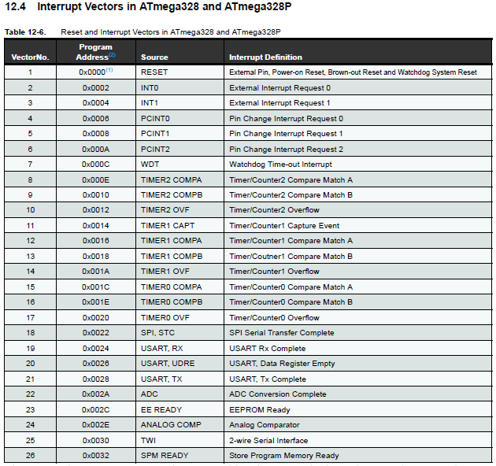
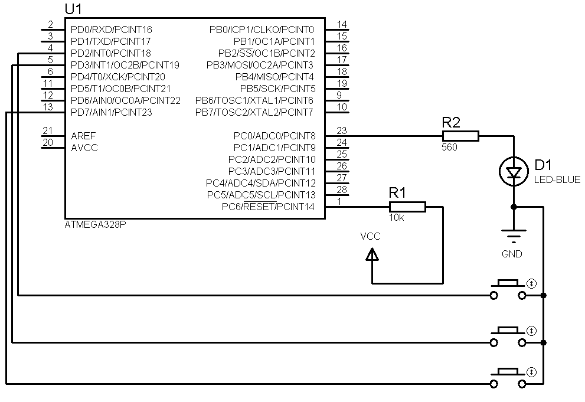

Embedded System Class
===


##### Presentation using [Marp](https://github.com/yhatt/marp)

###### Created by Eka Puji Widiyanto ( [@ekapujiw2002](https://github.com/ekapujiw2002) )

---

# AVR

- ATMEGA328PA
- Framework : AVR GCC, ARDUINO
- IDE : [PlatformIO](https://platformio.org/)
- Simulator : [Proteus](https://www.labcenter.com/)

---

# SIMULATOR


---

# SIMULATOR


---

# PlatformIO


---

# AVR GPIO

- Register : **DDRx, PORTx, PINx** (x = A,B,C,D)
- Konfigurasi GPIO

  |DDRx|PORTx|Mode|
  |---|---|---|
  |0|0|Input NO PULLUP|
  |0|1|Input PULLUP|
  |1|Output|-|

- Set GPIO

  |PORTx|Mode|
  |---|---|
  |0|LOW|
  |1|HIGH|

---

# AVR GPIO

- Get GPIO

  |PINx|Mode|
  |---|---|
  |0|LOW|
  |1|HIGH|
  
---

# AVR GPIO

- Include header io.h : `#include <avr/io.h>`
- *Nomenclature* = **x=A,B,C,...   y=0..7**
- Konfigurasi output : `DDRx |= _BV(PINxy)`
- Konfigurasi input : `DDRx &= ~_BV(PINxy)`
- Set output **HIGH** : `PORTx |= _BV(PINxy)`
- Set output **LOW** : `PORTx &= ~_BV(PINxy)` 
- Get pin **HIGH** : `bit_is_set(PINx, PINxy)`
- Get pin **LOW** : `bit_is_clear(PINx, PINxy)`
- Wait pin : `loop_until_bit_is_set(PINx, PINxy)  loop_until_bit_is_clear(PINx, PINxy)`

---

```
#include <avr/io.h>
#include <util/delay.h>

#define PIN_OUT PINC0
#define PIN_OUT4 PINC4
#define PIN_OUT5 PINC5
#define PIN_IN PINC1

int main() {

  // set sbg output
  DDRC |= _BV(PIN_OUT) | _BV(PIN_OUT4) | _BV(PIN_OUT5);
  PORTC &= ~(_BV(PIN_OUT) | _BV(PIN_OUT4) | _BV(PIN_OUT5));

  // set sbg input dg pullup
  DDRC &= ~(_BV(PIN_IN));
  PORTC |= _BV(PIN_IN);
  
  // DDRC = 0b00000001;
```

---

``` 

  // while (1) {
  //
  // }

  for (;;) {
    // PORTC |= _BV(PIN_OUT);
    // _delay_ms(500);
    // PORTC &= ~_BV(PIN_OUT);
    // _delay_ms(500);

    PORTC ^= _BV(PIN_OUT) | _BV(PIN_OUT4);

    if (bit_is_clear(PINC, PIN_IN)) {
      PORTC |= _BV(PIN_OUT5);
      loop_until_bit_is_set(PINC, PIN_IN);
      PORTC &= ~_BV(PIN_OUT5);
    }
    _delay_ms(500);
  }

  return 0;
}

```

---

# Interupsi

- > Mekanisme untuk menyela sebentar proses yang sedang berjalan di prosesor
- Asal :
  - **Hardware Interrupts**
  - **Software Interrupts**
- **ISR** : suatu fungsi dengan alamat khusus untuk suatu interupsi

---

# Interupsi : ISR Vector



---

# Interupsi : Langkah Penggunaan

- Masukkan *header* file interupsi : `#include <avr/interrupt.h>`
- Aktifkan dan konfigurasi interupsi yang akan dipergunakan serta **ISR**
- Aktifkan **Global Interrupt Flag** : `sei()`. Untuk mematikan **Global Interrupt Flag** pergunakan `cli()`

---

# Interupsi : Kode Program

```
#include <avr/interrupt.h>

ISR(vector_isr){
	// kode service rutin interrupt
}

int main(){
	// aktifkan dan konfigurasi interupsi
    // onkan global isr flag
    sei();
    
    for(;;);
}
```

---

# Interupsi : Do and Don't

- Interupsi bersifat **non nested**
- ISR harus singkat, cepat, jangan aktifkan ISR lainnya!
- Variabel yang dipergunakan di dalam ISR harus menggunakan flag **volatile** : `volatile int cnt;`

---

# Interupsi : Saklar Reaktif



---

# Serial Port

- Komunikasi dari dan ke dalam AVR via bit serial
- Standar komunikasi sistem *embedded*
- Sangat fleksibel dan *powerfull*
- Lihat pada Bab 20. USART0

---

# Fitur

- Full Duplex Operation (Independent Serial Receive and Transmit Registers)
- Asynchronous or Synchronous Operation
- Master or Slave Clocked Synchronous Operation
- High Resolution Baud Rate Generator
- Supports Serial Frames with 5, 6, 7, 8, or 9 Data Bits and 1 or 2 Stop Bits
- Odd or Even Parity Generation and Parity Check Supported by Hardware
- Data OverRun Detection

---

# Fitur

- Framing Error Detection
- Noise Filtering Includes False Start Bit Detection and Digital Low Pass Filter
- Three Separate Interrupts on TX Complete, TX Data Register Empty and RX Complete
- Multi-processor Communication Mode
- Double Speed Asynchronous Communication Mode

---

# Register

- Pilih *clock/xrystal* dengan *error baudrate* yang masih dapat ditoleransi
- Lihat di **Table 20-4. Examples of UBRRn Settings for Commonly Used Oscillator Frequencies**
- **Error Rate <= 5%**

---

# Timer

- Pewaktu
- Tipe : 8bit dan 16bit
	- 8bit : **TIMER0, TIMER2**
	- 16bit : **TIMER1**
- Input (internal dan eksternal)
- Output (internal dan eksternal)

---

# TIMER0

- Referensi : **15. 8-bit Timer/Counter0 with PWM**
- 8bit
- 2 kanal PWM
- 1 kanal **capture external**
- Register :
	- OCR0A, OCR0B
	- OC0A, OC0B
	- TCCR0A, TCCR0B
	- TCNT0
	- TOV0

---

# TIMER0

|MODE|FUNGSI|
|---|---|
|NORMAL|Pewaktu biasa|
|CTC|Clock generator|
|FAST PWM|PWM kasar|
|PHASE CORRECT|PWM smooth|

---

# TIMER0 : MODE NORMAL

- Pewaktu
- Cacahan : 0 - 255
- `Waktu tunda = (PSC / XTAL) * CNT`
	- XTAL = kristal (Hz)
	- PSC = prescalar : 1,8,64,256,1024
	- CNT = nilai cacahan yang diperlukan
	- Waktu tunda dalam detik
- Contoh :
```
Waktu tunda = 10ms = 10*10^-3 detik = 10^-2 detik
10^-2 = (1 / 16*10^6) * CNT ==> CNT = 160000 ==> >255
PSC = 1024 ==> CNT = 156,25
CNT = 156 ==> Waktu tunda = 9,984ms
CNT = 157 ==> Waktu tunda = 10,084ms

Waktu tunda 10ms, PSC=1024, XTAL=16MHz, CNT=156
Nilai yang harus diset = 256-156 = 100 = TCNT0
```
---

# TIMER0 : MODE NORMAL

- Referensi : **15.9 Register Description dan Table 15-8. Waveform Generation Mode Bit Description**
- Set value register 
```
TCCR0A = 0
TCCR0B = PSC
TCNT0 = Nilai waktunya
TOV0 = penanda akhir waktunya
```