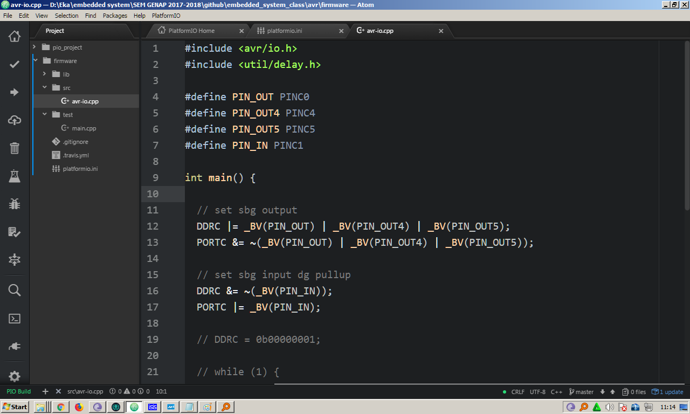

Embedded System Class
===


##### Presentation using [Marp](https://github.com/yhatt/marp)

###### Created by Eka Puji Widiyanto ( [@ekapujiw2002](https://github.com/ekapujiw2002) )

---

# AVR

- ATMEGA328PA
- Framework : AVR GCC, ARDUINO
- IDE : [PlatformIO](https://platformio.org/)
- Simulator : [Proteus](https://www.labcenter.com/)

---

# SIMULATOR


---

# SIMULATOR


---

# PlatformIO



---

# AVR GPIO

- Register : **DDRx, PORTx, PINx** (x = A,B,C,D)
- Konfigurasi GPIO

  |DDRx|PORTx|Mode|
  |---|---|---|
  |0|0|Input NO PULLUP|
  |0|1|Input PULLUP|
  |1|Output|-|

- Set GPIO

  |PORTx|Mode|
  |---|---|
  |0|LOW|
  |1|HIGH|

---

# AVR GPIO

- Get GPIO

  |PINx|Mode|
  |---|---|
  |0|LOW|
  |1|HIGH|
  
---

# AVR GPIO

- Include header io.h : `#include <avr/io.h>`
- *Nomenclature* = **x=A,B,C,...   y=0..7**
- Konfigurasi output : `DDRx |= _BV(PINxy)`
- Konfigurasi input : `DDRx &= ~_BV(PINxy)`
- Set output **HIGH** : `PORTx |= _BV(PINxy)`
- Set output **LOW** : `PORTx &= ~_BV(PINxy)` 
- Get pin **HIGH** : `bit_is_set(PINx, PINxy)`
- Get pin **LOW** : `bit_is_clear(PINx, PINxy)`
- Wait pin : `loop_until_bit_is_set(PINx, PINxy)  loop_until_bit_is_clear(PINx, PINxy)`

---

```
#include <avr/io.h>
#include <util/delay.h>

#define PIN_OUT PINC0
#define PIN_OUT4 PINC4
#define PIN_OUT5 PINC5
#define PIN_IN PINC1

int main() {

  // set sbg output
  DDRC |= _BV(PIN_OUT) | _BV(PIN_OUT4) | _BV(PIN_OUT5);
  PORTC &= ~(_BV(PIN_OUT) | _BV(PIN_OUT4) | _BV(PIN_OUT5));

  // set sbg input dg pullup
  DDRC &= ~(_BV(PIN_IN));
  PORTC |= _BV(PIN_IN);
  
  // DDRC = 0b00000001;
```

---

``` 

  // while (1) {
  //
  // }

  for (;;) {
    // PORTC |= _BV(PIN_OUT);
    // _delay_ms(500);
    // PORTC &= ~_BV(PIN_OUT);
    // _delay_ms(500);

    PORTC ^= _BV(PIN_OUT) | _BV(PIN_OUT4);

    if (bit_is_clear(PINC, PIN_IN)) {
      PORTC |= _BV(PIN_OUT5);
      loop_until_bit_is_set(PINC, PIN_IN);
      PORTC &= ~_BV(PIN_OUT5);
    }
    _delay_ms(500);
  }

  return 0;
}

```
